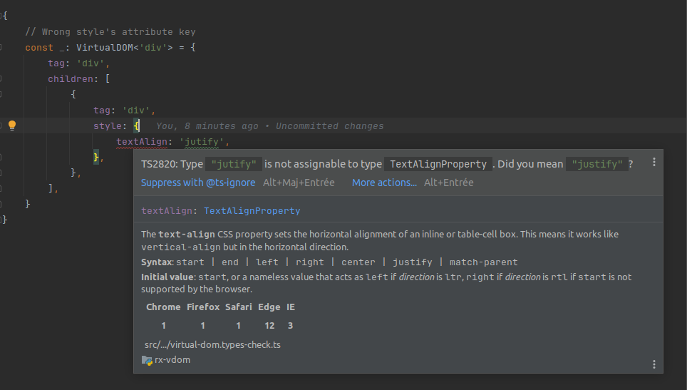

# Rx-VDom 

<code-badges version="{{rxvdom-version}}" npm="rx-vdom" github="w3nest/rx-vdom" license="mit">
</code-badges>

--- 

**A lightweight, observable-friendly library for reactive & declarative DOM structures.**

Key features of the library include:

- **Compact Size & Dependency-Free:** The compressed bundle size is <rx-vdom-size></rx-vdom-size>. Reactivity,
  commonly with <ext-link target="rxjs">RxJS</ext-link>, is opt-in by the consumer.

- **Simple & Consistent API:** The API is minimal, building directly on standard HTML and reactive programming
  principles. The library is not even required to define components, only to render them.

- **Type Safety:** Powered by the strongly-typed <api-link target='VirtualDOM' kind='type-alias'></api-link> structure,
  offering seamless type checking and inline support in TypeScript.

<note level="hint" title="Side by Side API doc." icon="fas fa-columns   ">
This documentation contains many inline links to the API documentation, like the 
<api-link target='VirtualDOM' kind='type-alias'></api-link> reference above. To improve reading experience on larger
screens, you can toggle **side-by-side** layout by clicking <split-api></split-api> (also available in the 
left navigation pane).

</note>

---

## Example Usage

**🧠 The Reactive View, at Its Simplest**

The next (live) example demonstrates the core concept of {{rx-vdom}}: you handle reactivity explicitly with observables, 
while the library declaratively connects them to the DOM.

<example-timer>
</example-timer>

<note level="hint" title="Observables First, Library Second" icon="fas fa-bolt">
The example above showcases most of {{rx-vdom}}'s core API in action. Once you're familiar with it, you'll find that 
the structure and flow of your application are primarily driven by how you shape and compose observables—**not** 
by the library itself.
For instance, RxJS offers a rich set of <ext-link target="rxjsOperators">operators</ext-link> 
that let you model time, events, and state with power and precision.
</note>

<note level="hint" title="Comparing to React & Vue" expandable="true">

To offer a practical comparison of how **rx-vdom** stacks up against <ext-link target='react'>React</ext-link> and
<ext-link target='vue'>Vue</ext-link>, an AI code generator tool has been used to generate equivalent implementations 
of the simple clock component. 

**React**

<code-snippet language='javascript'>
import React, { useState, useEffect } from 'react';

export const Clock = () => {
  const [time, setTime] = useState(new Date().toLocaleTimeString());
  const [isSuccess, setIsSuccess] = useState(false);

  useEffect(() => {
    const intervalId = setInterval(() => {
      setTime(new Date().toLocaleTimeString());
      setIsSuccess((prev) => !prev); // Toggle the class every second
    }, 1000);

    return () => clearInterval(intervalId); // Cleanup interval on unmount
  }, []);
  
  return (
    

      <i className={`${isSuccess ? "text-success" : ""} fas fa-clock`}></i>
      <i className="mx-1">{time}</i>
    

  );
};
</code-snippet>

**Vue**

<code-snippet language='javascript'>
<template>
  

    <i :class="['fas', 'fa-clock', isSuccess ? 'text-success' : '']"></i>
    <i class="mx-1">{{ time }}</i>
  

</template>

</code-snippet>

Below are a few highlights that help position {{rx-vdom}}:

*  **Minimal Setup**: In {{rx-vdom}}, components are simply plain JavaScript objects, with minimal boilerplate.
   You can create components dynamically using functions or classes and manipulate them using plain JavaScript.
   Notably, the framework is not even required to define components, making it extremely lightweight.

*  **Explicit and Transparent**: The declarative syntax of {{rx-vdom}} provides a clear understanding of the scope of
   updates. Reactivity and component structure are explicitly defined, without relying on underlying mechanisms like 
   virtual DOM diffing or automatic dependency tracking.

*  **Automatic Lifecycle Management**: {{rx-vdom}}  takes care of its own lifecycle. Subscriptions are automatically
   managed, eliminating the need to manually clean up or handle lifecycle events. Custom subscriptions can also be 
   tied directly to the component's lifecycle, offering flexibility.

*  **Learning Reactive Programming**: Learning {{rx-vdom}} is essentially learning reactive programming itself. 
   While it may take more time to master compared to React or Vue, the knowledge gained is widely applicable 
   beyond UI development, making it a valuable skill for various programming contexts.

*  **Minimal Scope**: {{rx-vdom}} is designed for in-browser SPA (Single Page Application) 
   development. It is not intended for server-side rendering or other broader use cases, so developers should be
   mindful of its current limitations.

If you have any suggestions or insights that could help position the library better, 
please feel free to open a GitHub issue on the 
<github-link target="rx-vdom">repository</github-link>. 
Your feedback is always welcome!

</note>

**🦖 T-Rex Runner: a reactive sprite in 50 lines**

The next example serves as a more expressive demonstration of how rx-vdom empowers you to build fully declarative, 
reactively driven views — with no manual DOM updates, no mutation code, and no imperative side-effects.

We use RxJS to drive a T-Rex sprite animation that reacts to time-based state, and `rx-vdom` binds it directly to 
the DOM in a fully declarative style.

<example-trex>
</example-trex>

* ✅ **Reactive state**: The entire animation is driven by RxJS.
* ✅ **Declarative view**: The DOM structure is just a data object.
* ✅ **Reactive styles**: Style changes are streamed — no `setAttribute`, `classList`, or manual DOM mutation.
* ✅ **No custom components needed**: All done with plain objects and operators.

The above implementation is adapted from <ext-link target="rxjs-trex">this article</ext-link>, which also offers a
meaningful comparison between observables and signals in reactive programming.

## TypeScript first

Every virtual DOM declaration in {{rx-vdom}} is fully type-checked against the corresponding native HTML element.
This includes attributes, styles, and even tag-specific constraints. In particular, you get instant feedback from your 
IDE when something doesn't match.

For example, trying to assign an incorrect style value will trigger a compile-time error:

<figure class="my-3">
  
  <figcaption class='w-75 text-center mx-auto'>🛡️ Incorrect attributes or styles are caught at 
  compile time, with helpful tooltips from your IDE.</figcaption>
</figure>

---

## Next Steps

* 🚀 <cross-link target="gettingStarted">Get Started</cross-link>: Dive into the first interactive tutorial notebook to 
  learn the basics and quickly get up to speed.

* 🛠️ <cross-link target="howTo">How-to Guide</cross-link>: Find step-by-step instructions on installation and 
  setting up in TypeScript environments.

* 📚  <cross-link target="api">API Documentation</cross-link>: Explore the full API to understand the library's 
  capabilities in depth.

* 💻 <github-link target="examples">Examples on GitHub</github-link>: Check out practical examples,
   including a complete "todos" app in both JavaScript and TypeScript.

